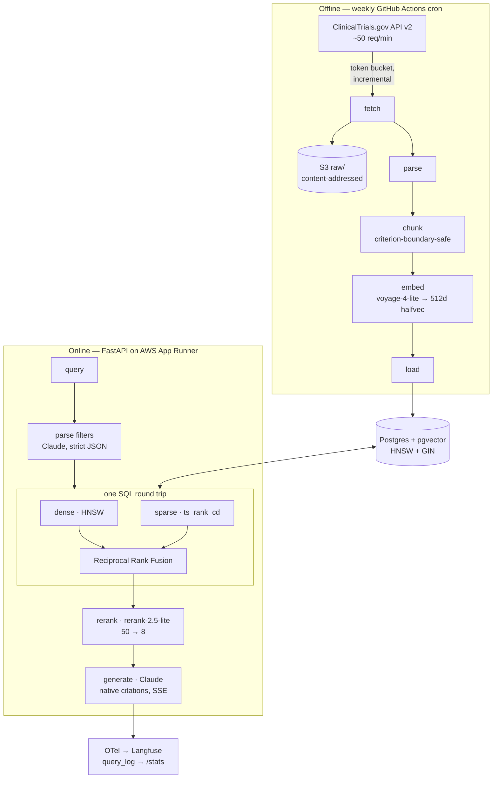

# TrialRAG

**Ask questions about clinical trial protocols. Get answers with span-level citations back to the exact source text.**

A production-grade retrieval-augmented generation system over ClinicalTrials.gov,
built to be *measured* rather than demoed: hybrid retrieval with a published
ablation table, a deterministic evaluation harness that gates every pull request,
LLM-judge metrics calibrated against human labels, and per-request cost and
latency attribution on a public dashboard.

> **Status: in development.** Milestones M0–M6 are tracked in
> [`docs/ROADMAP.md`](docs/ROADMAP.md). The live URL and the evaluation numbers
> below land at M4 and M5 respectively. Nothing in this README is a projection —
> numbers appear here only once a committed eval run produces them.

---

## Why this corpus

ClinicalTrials.gov study records are half structured, half free text. The free
text (summaries, eligibility criteria, outcome measures) is what gets indexed and
retrieved. The structured fields (`minimumAge`, `phases`, `overallStatus`,
`leadSponsor`, `enrollment`) are **machine-verifiable ground truth**.

That asymmetry is the foundation of the whole project:

1. **Golden datasets are generated, not hand-labeled.** Thousands of Q&A pairs
   whose answers are structured field values, with the gold chunk known by
   construction.
2. **Retrieval metrics are deterministic and free.** Recall@k, MRR and nDCG need
   no LLM, so they run on every PR in seconds and never flake.
3. **Contextual retrieval costs nothing.** The usual technique spends an LLM call
   per chunk to write a context header. Here the structured metadata already is
   that context, so the header is synthesised deterministically — reproducible,
   and $0.

---

## Architecture



**Deliberately no LangChain or LlamaIndex.** At this scale an orchestration
framework buys indirection, version churn and hidden prompts. The retrieval SQL
and the Anthropic calls are written directly. Rationale and trade-offs:
[ADR-002](docs/adr/).

---

## Evaluation

Two tiers, split by cost and determinism — the split is the design, not an
implementation detail.

| Tier | What | Cost | Cadence |
|---|---|---|---|
| **1 — Retrieval** | Recall@{1,5,10,20}, MRR, nDCG@10, sliced by section / query type / condition | $0, deterministic | Every PR, as a merge gate |
| **2 — Generation** | Ragas faithfulness & context metrics, citation validity, numeric accuracy, abstention precision/recall | Batch API, 50% off | Nightly |

Custom judges worth naming:

- **Citation validity** — every citation span must literally exist in the chunk
  it cites. Deterministic, zero LLM cost, and a direct measure of hallucinated
  attribution. Native Anthropic citations are what make this checkable at all.
- **Numeric accuracy** — exact match against structured ground truth.
- **Appropriate abstention** — scored against a dedicated unanswerable set.

Judge hygiene: judge model distinct from the generator, 3-sample majority,
position-swapped pairwise comparison, and a ~50-item human-labeled calibration
set with **judge-vs-human Cohen's κ reported** in `docs/EVALUATION.md`. An
uncalibrated judge is a number, not a measurement.

---

## Quickstart

```bash
brew install uv colima docker docker-compose   # one-time
colima start                                    # container runtime

cp .env.example .env                            # add ANTHROPIC_API_KEY + VOYAGE_API_KEY
make setup                                      # uv sync + pre-commit hooks
make db-up                                      # postgres 17 + pgvector, otel-collector
make migrate
make ingest LIMIT=100                           # smoke-scale corpus
make run                                        # http://localhost:8000
```

Full target list: `make help`.

---

## Repository layout

| Path | Contents |
|---|---|
| `src/trialrag/ingest/` | fetch → parse → chunk → embed → load |
| `src/trialrag/retrieval/` | filter parsing, hybrid SQL, RRF, reranking |
| `src/trialrag/generation/` | provider interface, Anthropic adapter, citations, guardrails |
| `src/trialrag/api/` | FastAPI app, SSE streaming, cost circuit breaker |
| `evals/` | dataset builder, retrieval eval, judge suite, ablation runner |
| `terraform/` | App Runner, ECR, S3, IAM, Secrets Manager, alarms |
| `docs/` | `DESIGN.md`, `EVALUATION.md`, `RUNBOOK.md`, `adr/` |

---

## Documentation

- [`docs/DESIGN.md`](docs/DESIGN.md) — requirements, capacity estimates, data
  model, failure modes, security model, and the scale-to-1000-RPS analysis
- [`docs/EVALUATION.md`](docs/EVALUATION.md) — dataset construction, metric
  definitions, ablation tables, judge calibration
- [`docs/RUNBOOK.md`](docs/RUNBOOK.md) — alerts, dashboards, rollback
- [`docs/adr/`](docs/adr/) — architecture decision records

---

## Disclaimer

TrialRAG summarises publicly registered clinical trial protocols. It is **not
medical advice**, does not evaluate whether any trial is appropriate for any
individual, and must not be used to make treatment decisions. Always consult a
qualified clinician. Source records are authoritative at
[clinicaltrials.gov](https://clinicaltrials.gov).

## License

MIT
